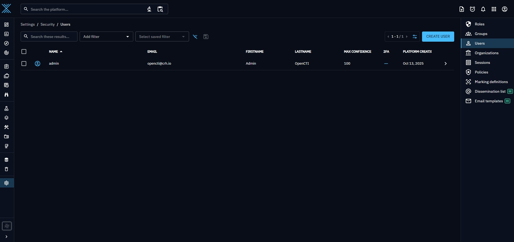
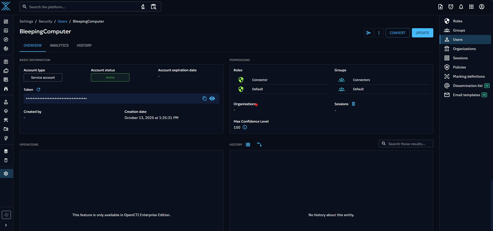
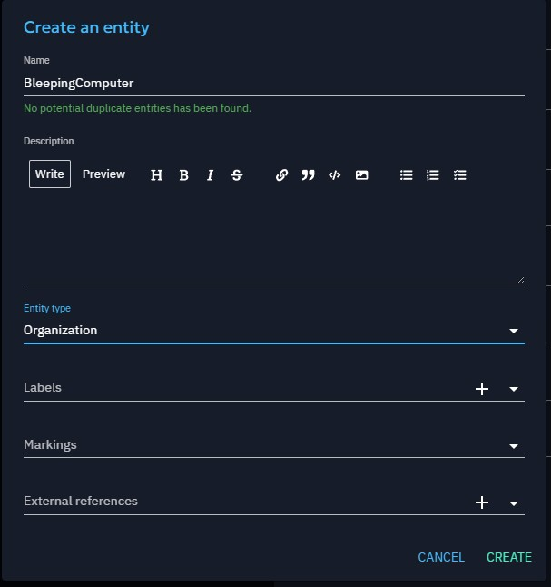
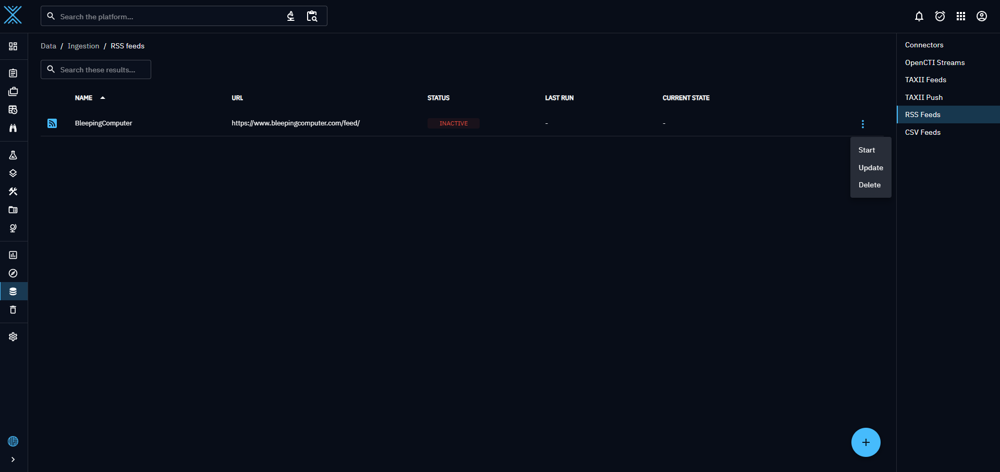

# Usage
This open cti service is the one being used by our project to fetch data from the open cti platform using the open cti api.
# IMPORTANT:
run **docker network create open-cti-network** before running the container to make sure the open cti container is reachable to get info pulled from.  

# To run:

1- Clone the **crh-open-cti-integration** repository.

2- If you want to use mitmproxy (dummy proxy), you can start the proxy using the following command: 

**docker run --rm -it -p 3128:3128 -p 8888:8888 -v 'CHANGE PATH HERE ACCORDING TO YOUR SYSTEM\capstone\crh-developer-environment\certificates':/home/mitmproxy/.mitmproxy  mitmproxy/mitmproxy mitmweb --listen-port 3128 --web-port 8888 --web-host 0.0.0.0** from any service path

(Contact the maintainers to get the certificates)

If you have your own proxy, you don't need to create that proxy container, just use your proxy credentials in the .env file that is present in the open cti service folder, replace HTTP_PROXY and HTTPS_PROXY variables with your own. Also update the CERTIFICATE_LOCATION by putting the absolute path of that folder but that is relative to your machine and change the CERTIFICATE_PATH_CONTAINER as well. See the .env file.

If you don't want to use proxies, life is easy! just comment all places in the docker-compose.yml that contain the comment: # CAUTION: COMMENT IF NOT USING PROXY SERVER. As those settings are only needed 
when proxy is enabled.

2- Once inside the **crh-open-cti-integration** folder, run: **docker compose build**

3- Once inside the **crh-open-cti-integration** folder, run: **docker compose up -d** (if elasticSearch isn't starting, try to reduce the value of ELASTIC_MEMORY_SIZE or increase the memory your system gives docker)

4- Wait few minutes until the web app is up and running. 

5- Even if the web app is up, you might not see data; this is because the built in data ingestor; **alien-vault** may take up to 2 hours to finish ingesting data, so be patient.

You can change the date starting which information will be ingested for alienvault, you can change **ALIENVAULT_PULSE_START_TIMESTAMP** in docker-compose.yml to a more recent date to have things spin up quickly.

6- Once you start to see some data, check Data -> Ingestion -> Monitoring -> AlienVault. It is advisable to not change anything else until the ingestion finishes for that connector.

7- Once ingestion is done for the alienvault connector, check the **Data/Ingestion/RSS feeds**; if **Bleeping Computer** isn't present. Add it using the remaining steps.

8- Go to Settings/Security/Users, and add a new user:

9- After filling the information, the end result should look like the screenshot. (Make sure to specify that this user is a service account, that way you won't have to provide an email or a password.)
  

Important information: name: BleepingComputer -> groups: connectors

10- Back to Data/Ingestion/RSS Feeds, add **Bleeping Computer** as an RSS feed: (For the default author, click on the + icon to create a new author, and make it an organization)

11- Then, click on the three dots to start the rss feed service:

12- You are good to go! more info on querying the open cti service can be found here: 

# Resources: 

https://docs.opencti.io/latest/reference/api/#:~:text=OpenCTI%20provides%20a%20comprehensive%20API%20based%20on%20GraphQL%2C,a%20powerful%20tool%20for%20automation%2C%20integration%2C%20and%20customization.

a graphql playground to make api requests can be found on http://localhost:8080/public/graphql

More info on open cti data ingestion can be found here: https://docs.opencti.io/latest/usage/import-automated/#best-practices-for-feed-import

# Warning!!! 

Rest Api service uses the same port as open cti, unless a change is made to the api you can't as for now run open cti and the rest api same time.

# OpenCTI Docker deployment

## Documentation

You can find the detailed documentation about the Docker installation in the [OpenCTI documentation space](https://docs.opencti.io/latest/deployment/installation/#using-docker).

## Community

### Status & bugs

Currently OpenCTI is under heavy development, if you wish to report bugs or ask for new features, you can directly use the [Github issues module](https://github.com/OpenCTI-Platform/opencti/issues).

### Discussion

If you need support or you wish to engage a discussion about the OpenCTI platform, feel free to join us on our [Slack channel](https://community.filigran.io). You can also send us an email to contact@opencti.io.

## About

OpenCTI is a product designed and developed by the company [Filigran](https://filigran.io).

