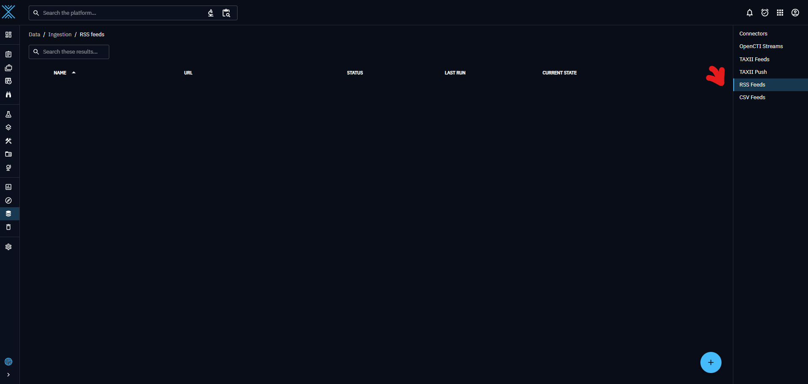

# Usage
This open cti service is the one being used by our project to fetch data from the open cti platform using the open cti api.
# IMPORTANT:
run **docker network create open-cti-network** before running the container to make sure the open cti container is reachable to get info pulled from.  

# To run:

1- Clone the **crh-open-cti-integration** repository.

2- Once inside the **crh-open-cti-integration** folder, run: **docker compose up -d**

3- Wait few minutes until the web app is up and running. 

4- Even if the web app is up, you might not see data; this is because the built in data ingestor; **alien-vault** may take up to 10 minutes to finish ingesting data, so be patient.

5- Once you start to see some data, check the **Data/Ingestion/RSS feeds**; if **Bleeping Computer** isnt present. Add it using the remaining steps.

6- Go to Settings/Security/Users, and add a new user using the plus button at the bottom right:

7- After filling the information, the end result should look like the screenshot. 
  

Important information: name: BleepingComputer -> email: bleep@opencti.io -> pwd: bleep2  -> groups: connectors

8- Back to Data/Ingestion/RSS Feeds, add **Bleeping Computer** as an RSS feed: (For the default author, click on the + icon to create a new author, and make it an organization)

9- Then, click on the three dots to start the rss feed service:

10- You are good to go! more info on querying the open cti service can be found here: 

# Resources: 

https://docs.opencti.io/latest/reference/api/#:~:text=OpenCTI%20provides%20a%20comprehensive%20API%20based%20on%20GraphQL%2C,a%20powerful%20tool%20for%20automation%2C%20integration%2C%20and%20customization.

a graphql playground to make api requests can be found on http://localhost:8080/public/graphql

More info on open cti data ingestion can be found here: https://docs.opencti.io/latest/usage/import-automated/#best-practices-for-feed-import

# Warning!!! 

Rest Api service uses the same port as open cti, unless a change is made to the api you can't as for now run open cti and the rest api same time.

# OpenCTI Docker deployment

## Documentation

You can find the detailed documentation about the Docker installation in the [OpenCTI documentation space](https://docs.opencti.io/latest/deployment/installation/#using-docker).

## Community

### Status & bugs

Currently OpenCTI is under heavy development, if you wish to report bugs or ask for new features, you can directly use the [Github issues module](https://github.com/OpenCTI-Platform/opencti/issues).

### Discussion

If you need support or you wish to engage a discussion about the OpenCTI platform, feel free to join us on our [Slack channel](https://community.filigran.io). You can also send us an email to contact@opencti.io.

## About

OpenCTI is a product designed and developed by the company [Filigran](https://filigran.io).

